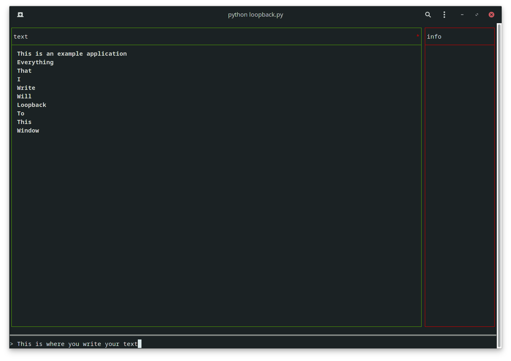

# terminal-text-boxes
A framework for terminal text box functionality used for chat applications, general text flow applications and more...

# Setup

To clone the repository:

    $ git clone https://github.com/alexemanuelol/terminal-text-boxes.git

Install the required packages:

    $ cd terminal-text-boxes
    $ pip install -r requirements.txt

## Example Usage

[Click here](src/tests/loopback.py) to view a test application (loopback.py) of the framework. A simple application that creates a setup with two boxes. Whenever you press enter, the text will loopback to the left-most box.

## Documentation

For more information about the different functions and structures, [click here](docs/docs.md).
